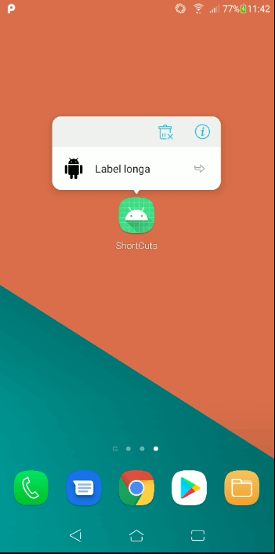

# Android-Shortcuts-Estudo

# Criando Shortcuts (Atalhos)

### Documentação relacionada :

[Create shortcuts | Android Developers](https://developer.android.com/guide/topics/ui/shortcuts/creating-shortcuts)

### Criando um atalho estático:

No arquivo **AndroidManifest.xml** devemos procura a Activity que contém a  ação (action) **android.intent.action.MAIN action** e a categoria **android.intent.category.LAUNCHER:**

```xml
<meta-data android:name="android.app.shortcuts"
      android:resource="@xml/shortcuts" />
```

**AndroidManifest.xml:**

```xml
<?xml version="1.0" encoding="utf-8"?>
<manifest xmlns:android="http://schemas.android.com/apk/res/android"
    package="net.azurewebsites.shortcuts">

    <application
        android:allowBackup="true"
        android:icon="@mipmap/ic_launcher"
        android:label="@string/app_name"
        android:roundIcon="@mipmap/ic_launcher_round"
        android:supportsRtl="true"
        android:theme="@style/AppTheme">
        <activity android:name=".MainActivity">
            <intent-filter>
                <action android:name="android.intent.action.MAIN" />

                <category android:name="android.intent.category.LAUNCHER" />
            </intent-filter>

            <meta-data android:name="android.app.shortcuts"
                android:resource="@xml/shortcuts" />

        </activity>
    </application>

</manifest>
```

### Criando o arquivo **@xml/shortcuts:**

```xml
<shortcuts xmlns:android="http://schemas.android.com/apk/res/android">
    <shortcut
        android:shortcutId="id"
        android:enabled="true"
        android:icon="@mipmap/ic_android"
        android:shortcutShortLabel="@string/shortcut_short_label"
        android:shortcutLongLabel="@string/shortcut_long_label"
        android:shortcutDisabledMessage="@string/disabled_message">
        <intent
            android:action="android.intent.action.VIEW"
            android:targetPackage="net.azurewebsites.shortcuts"
            android:targetClass="net.azurewebsites.shortcuts.MainActivity" />
        <!-- Se o seu atalho estiver associado a várias intenções, inclua-as
             aqui. A última intenção na lista determina o que o usuário vê quando
             eles iniciam esse atalho. -->
        <categories android:name="android.shortcut.conversation" />
    </shortcut>
    <!-- Especifique mais atalhos aqui. -->
</shortcuts>
```

### String.xml

```xml
<resources>
    <string name="app_name">ShortCuts</string>
    <string name="shortcut_short_label">Label curta</string>
    <string name="shortcut_long_label">Label longa</string>
    <string name="disabled_message">Mensagem desativada</string>
</resources>
```

### Resultado:


